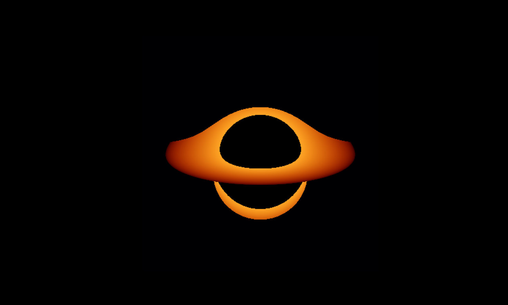

# Relativistic Gravitational Lensing & Black Hole Ray-Tracer

A high-performance, fully vectorized 3D relativistic ray-tracer written in Python using NumPy and Matplotlib(a more updated and better version of my previous attempt, which can be found by the name 'Schwarzschild-2D-Orbiter'). This engine simulates the paths of photons traveling through curved spacetime around a non-rotating (**Schwarzschild**) black hole, generating mathematically accurate photographs of gravitational lensing and the iconic warped accretion disk halo structure.

---

## Rendered Output (try appreciating this absolute beauty)



---

## Technical Features

* **Vectorized Physics Engine:** Operates entirely without inner `for` loops, processing tens of thousands of photons simultaneously in parallel C-code via NumPy broadcasting.
* **Accretion Disk Shader:** Simulates a horizontal equatorial matter disk, mapping color intensities via a relative heat gradient based on proximity to the event horizon.
* **Arbitrary 3D Camera Projection:** Supports flexible camera positions, focal scaling, and look-at vectors to capture the black hole from any spatial vantage point.
* **Accurate Gravitational Deflection:** Solves the Einstein Field Equations using a step-integrated numerical approximation for light deflection around a point-mass singularity.

---

## The Mathematics Behind the Physics

A real black hole warps space and time so drastically that light rays do not travel in straight lines. To calculate exactly how much a photon's path curves every fraction of a second, this engine uses a numerical approximation derived from **General Relativity**.

### 1. The Gravity Force Multiplier
In standard Newtonian physics, light has no mass, so it wouldn't experience gravity at all. Under General Relativity, the gravitational acceleration experienced by a photon is dependent on its **Angular Momentum** ($L$) and its distance ($r$) from the singularity.

The magnitude of the relativistic force multiplier can be modeled as:

$$force\_mag = -1.5 \cdot \frac{r_s \cdot L^2}{r^5}$$

Where:
* $r_s$ is the **Schwarzschild Radius** (the boundary of the event horizon, defined as $r_s = \frac{2GM}{c^2}$).
* $L$ is the scalar squared magnitude of the photon's specific orbital angular momentum: $L^2 = \|\vec{r} \times \vec{v}\|^2$.
* $r$ is the Euclidean distance from the black hole center: $r = \|\vec{r}\|$.

### 2. Deflection Vectors
The acceleration vector $\vec{a}$ applied to the photon's velocity matrix at each discrete time step ($dt$) is calculated by projecting that force magnitude back along the radial position vector $\vec{r}$:

$$\vec{a} = force\_mag \cdot \vec{r}$$

Because the force falls off exponentially at a factor of $1/r^5$, photons passing in deep space experience effectively zero deflection, while photons skimming the **photon sphere** ($r = 1.5 \cdot r_s$) are violently gripped, making sharp U-turns or collapsing directly into the event horizon.

---

## Code Architecture & Parallelization

The primary breakthrough of this iteration is the transition from nested Python `for` loops to **Vectorized Array Masking**. 

### The Problem with Standard Loops
Processing a $300 \times 300$ pixel sensor grid requires tracking $90,000$ individual rays. Running a 900-step numerical simulation would require $90,000 \times 900 = 81,000,000$ loop operations. In pure Python, this locks up the interpreter CPU thread indefinitely.

### The Vectorized Solution
We stack all $90,000$ photon coordinates into a giant $2\text{D}$ matrix of shape `(90000, 3)`. At every iteration step:
1.  **Array-Wide Operations:** Distance calculations, cross products, and matrix updates happen across all rows simultaneously via SIMD architecture.
2.  **Boolean Masking:** A tracking mask (`active_rays`) keeps tabs on every photon. If a photon sinks below the event horizon or successfully intersects the accretion disk plane, its active boolean state flips to `False`.
3.  **Selective Updating:** The engine selectively skips calculations for deactivated rows, drastically boosting computing performance:

```python
# Isolate rows where the photon crossed the Y=0 plane during this step
crossed_equator = active_rays & ((old_y > 0) & (position[:, 1] <= 0) | (old_y < 0) & (position[:, 1] >= 0))
```

### Customizing and Modifying the Camera
You can fly the camera around the singularity by manipulating, the code. To change the look-down angle over the equator, adjust the value added to the $Y$ positions:

```python
position[:, 1] = grid_y.flatten() + 4.5
```
## Conclusion
Honestly, this is the best and the most satisfying thing i have ever built, had been working on it since a long time, and finally seeing the output as that beautiful image, is just crazy.

